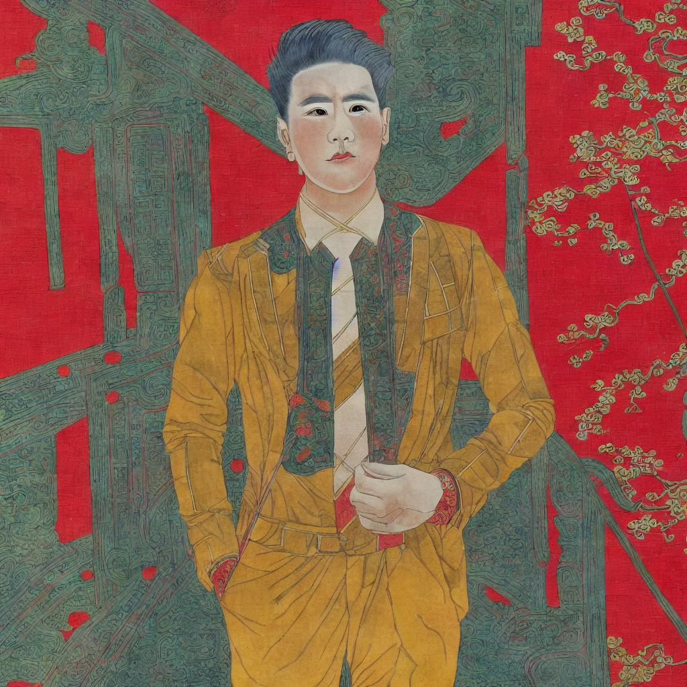
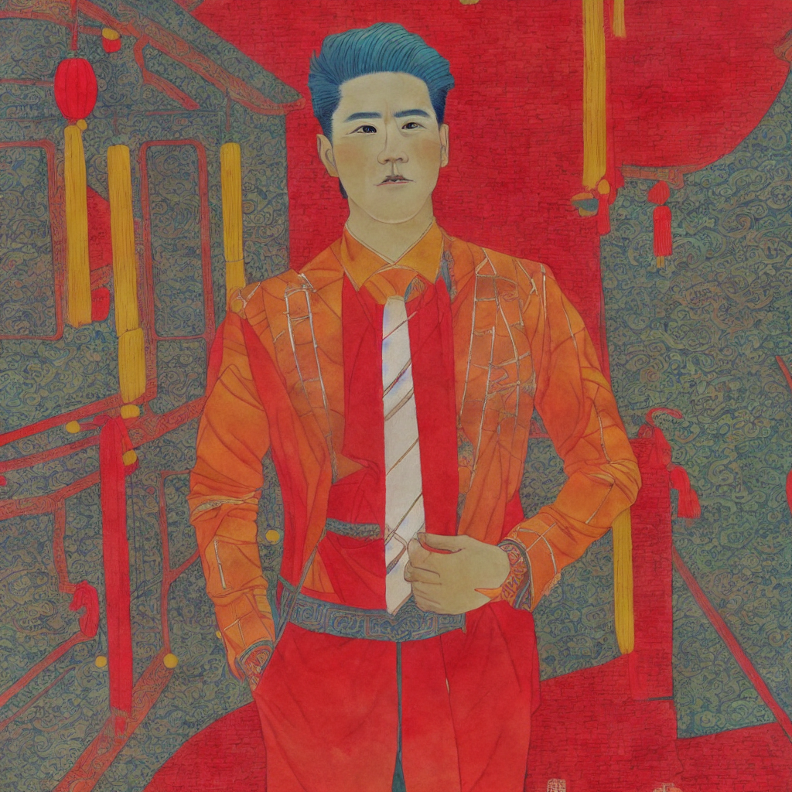

# Stable Diffusion for New Year wood-block print

## Introduction

The project aims to fine-tune the stable diffusion model to generate the Chinese New Year pictures from the portrait photos. **Lora** and **AdaLoRA** methods were applied to improve the generation quality.

## Models
Two models were used in the project:
- sd-controlnet-canny
- stable-diffusion-v1-5

We can download them from huggingface website:

```python
from diffusers import StableDiffusionControlNetPipeline, ControlNetModel

sd_path = 'runwayml/stable-diffusion-v1-5'
controlnet_canny_path = 'lllyasviel/sd-controlnet-canny'

controlnet = ControlNetModel.from_pretrained(controlnet_canny_path)
pipe =StableDiffusionControlNetPipeline.from_pretrained(
    sd_path, controlnet=controlnet
)
```

## Data

The original data can be found in [here](https://pan.baidu.com/s/1Dj_ZukKcFH23BDnSahAKmw?pwd=yben), which was collected from the [database of Chinese wooden New Year pictures](https://engravings.ancientbooks.cn/subIndexmbnh.jspx).

<div align="center">
    
    
    
    <br>
    <div>image examples</div>
</div>

## Start Up

Follow the steps below to run the project:
1. download the data following the link above and put it in the root folder.
2. download the models.
3. install the dependencies: `pip install -r requirements.txt`
4. Revise the path in the `main.ipynb` so that it can access the models and the data correctly and run the file `main.ipynb` step by step.
5. Revise the path in the `test.ipynb` and run it to test the model performance.

## Results
<div align="center">
    
    
    <br>
    
    
    <br>
    <div>generation example</div>
</div>
